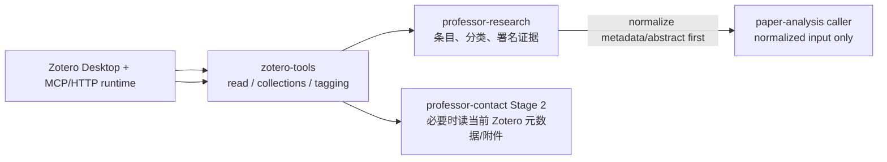

# zotero-tools

`zotero-tools` 提供 ScholarWorkflow 的 Zotero 读取、分类与论文标签工作流。它封装项目级 caller/agent 约定，但**不会把 Zotero Desktop、MCP 插件或本地 HTTP 服务本身打包进仓库**。

当前 APM target 为 `opencode` 与 `codex`。

## 在教授/套磁工作流中的位置

`paper-analysis` 本身不拥有 Zotero integration；Zotero-aware caller 应先在上游把需要的 metadata/abstract 规范化，再传给单篇分析。

## Package 与宿主环境要分开

APM 安装能保证本仓 skills/agents 随依赖闭包进入 consumer，但真实运行仍需要相应宿主条件，例如：

- Zotero Desktop 正在运行；
- 需要的 Zotero MCP 插件/本地服务已启用；
- runtime 使用的 endpoint 与当前隔离 fixture/用户实例一致；
- 写入类操作有明确 owner 与范围，不能因为 MCP 可达就跨 Stage 改写状态。

这些条件属于 runtime prerequisite；不能用“仓库已安装”推导“Zotero 一定在线”，也不能把生产 Zotero 库当自动化测试 fixture。

## 与 professor-contact 的边界

Zotero 是论文/元数据/附件存储与辅助组织层，不是套磁 target state：

- Stage 0 的机器目标来自 normalized `方向预筛.json` → `套磁目标.json`，不是 Zotero 固定标题 note；
- formal direction collection key 不是 canonical contact direction identity；
- Stage 3/5 不回读 Zotero 重建自己的唯一事实源；
- Stage 5 不需要 Zotero。

套磁状态机以 `ScholarWorkflow/professor-contact` 当前 workflow reference 为准。